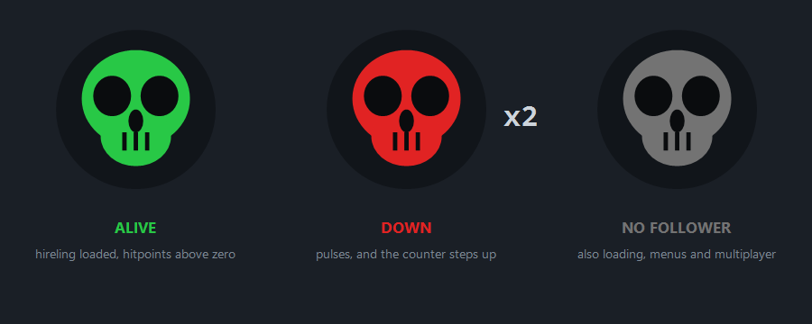

# Follower Alive Status

A TurboHUD plugin for Diablo III. A skull on your HUD turns red the moment your follower goes
down, green when they get back up, and stays grey when you have no follower hired — with a
counter that tallies **their** deaths and never yours.



Solo play only: followers cannot be brought into multiplayer games, so the icon stays grey there.

---

## What it does

- A skull icon on your HUD whose colour reflects the follower's state.
- A counter beside it, stepped up **only** on a confirmed *alive → dead* transition.
- Your own deaths, loading screens, zone changes and teleport chains never touch the counter.
- The town follower NPCs are ignored — only a genuinely hired hireling is tracked.
- Three icon styles: skull, plain dot, or the follower's portrait.
- Seven placements, including one docked under the tracker text on the minimap.

## Where it sits

By default the icon docks under the tracker text some HUD packs draw over the minimap. That text is
drawn from the top-left corner of the minimap element downwards, so this plugin anchors to the same
element and drops by an amount you can tune. **No file belonging to that pack is read or modified
for this.**

```
┌───────────────────────┐
│ Status:   Wait Botting│
│ Duration: 00:17:22    │
│ Rifts:    0R 0,00R/H  │  tracker text on the minimap
│ Greater:  0R 0,00R/H  │
│ Nephalem: 0R 0,00R/H  │
│                       │
│ [O] x2                │  <- this plugin
└───────────────────────┘
   minimap area
```

The drop is expressed as a number of those text lines, and the height of a line is measured live
rather than assumed, so **the icon keeps its place when you resize the game window**. That detail
matters: that text is sized to fit the minimap width but stops shrinking at 13.5 pixels, an
absolute floor, so it takes a larger share of the minimap on a small window than on a large
one. A fixed fraction of the minimap drifts into it as soon as the window changes size.

Other anchors: `UnderPortrait`, `LeftOfHealthGlobe`, `RightOfResourceGlobe`, `AboveSkillBar`,
`UnderMinimapClock`, and `Custom` for free placement by screen ratio.

## Install

1. Copy the `GuiSquare` folder into your TurboHUD `plugins` directory. The plugin is
   self-contained — no other files, no textures.

2. **If your HUD pack ships a plugin manager** that disables everything it does not know about,
   add one line to that manager's enable list:

   ```csharp
   "Turbo.Plugins.GuiSquare.FollowerAliveStatusPlugin"
   ```

3. Restart TurboHUD. If the icon overlaps that text or floats too low, set
   `MinimapTextLineCount` to the number of lines you actually see there, plus one.

## Configuration

Rename `GuiSquare/FollowerAliveStatusCustomizer.txt` to `.cs` to change any setting without editing
the plugin itself. Managed packs must whitelist the customizer too:
`"Turbo.Plugins.GuiSquare.FollowerAliveStatusCustomizer"`.

| Option | Default | What it controls |
| --- | --- | --- |
| `Position` | `BelowMinimapText` | Where the icon docks |
| `MinimapTextLineCount` | `11` | Drop below the minimap top edge, in tracker text lines. Resize-proof |
| `MinimapTextHeightRatio` | `0.46` | Legacy drop as a fraction of minimap height, used only when `MinimapTextLineCount` is `0` |
| `AutoFontSize` | `true` | Grow the counter past its nominal size until a line clears the floor, the way the text above it does |
| `CounterFontSize` / `TrackerTextSize` | `7.5` / `8.0` | Nominal sizes, before the floor applies |
| `MinLineHeight` | `13.5` | That floor, in pixels |
| `IconStyle` | `Skull` | `Skull`, `Dot` or `Portrait` |
| `IconSizeRatio` | `0.024` | Icon size, as a fraction of screen height |
| `ShowCounter` / `CounterOnRight` | `true` / `true` | Death counter, beside or inside the icon |
| `CounterPrefix` | `×` | Drawn in front of the number, so `×2` rather than a lone `2` |
| `BlinkWhenDead` | `true` | Pulse the icon while the follower is down |
| `HideWhenNoFollower` | `false` | Hide entirely instead of showing grey |
| `ResetCounterOnNewGame` | `false` | Session total, or per game |
| `ResetCounterOnClick` | `true` | Allow resetting the counter from the icon |
| `ResetClickRequiresCtrl` | `true` | Whether the reset click needs Ctrl held |
| `ResetClickButton` | `Left` | Mouse button used for the reset |
| `SpeakOnDeath` | `false` | Spoken alert when the follower dies |
| `DebugEnabled` | `false` | On-screen diagnostic panel (see below) |

Colours are plain TurboHUD brushes and can be replaced: `AliveBrush`, `DeadBrush`,
`NoFollowerBrush`, `IconDetailBrush`.

### The counter follows the window

The death counter is sized by the same rule the tracker text above it uses: a nominal size, grown
past it until a line clears `MinLineHeight` pixels. TurboHUD font sizes scale with the window, so
at 800x600 the nominal size lands well under that floor while the tracker text keeps growing until
it clears it -- drawing the counter at a fixed nominal size looks right at 1080p and visibly too
small at a low resolution. The search only runs after a resize, so it costs nothing per frame.
`AutoFontSize = false` turns it off and hands `CounterFont` / `CounterDeadFont` back to you.

### Resetting the counter

The counter is a running session total: it survives quitting to the menu and starting another
game, and only goes back to zero when TurboHUD restarts — or when you reset it yourself.

**Ctrl + click the icon** to reset it. Ctrl is required by default because the icon sits in the
top-left area where you click to move, and an accidental reset would be unrecoverable. The hover
tooltip always states the gesture currently in effect, and the click is swallowed either way so
your character never walks under the icon.

For a plain click with no modifier, either drop the requirement or move the reset to a button that
cannot be misclicked:

```csharp
plugin.ResetClickRequiresCtrl = false;
// optionally, a button not bound to movement:
plugin.ResetClickButton = System.Windows.Forms.MouseButtons.Middle;
```

## How the detection works

The interesting part of this plugin is not drawing a skull, it is refusing to count the wrong
thing. Two independent signals are read, with a deliberately asymmetric rule between them: the
follower counts as **alive if either source says alive**, and dead only when both agree. A failed
read can therefore never manufacture a death.

| Signal | Role |
| --- | --- |
| `IActor.Hitpoints` | Primary. Verified in game as current health: it drops to `0` on death while the actor stays present, then climbs back on revival. |
| `Hitpoints_Cur` | Secondary. This attribute is **not** exposed on follower actors — it returns `-1` — so it can only ever confirm life, never death. |
| Actor SNO | Strict match on the three hired hirelings: `_hireling_templar` (52693), `_hireling_scoundrel` (52694), `_hireling_enchantress` (4482). The town NPC versions carry different SNOs. |
| Pet item slots | Follower gear in `PetRightHand`…`PetBracers` proves a follower is hired even at a moment the actor is not loaded. |

On top of that, a death is only ever recorded after the plugin has **confirmed the follower alive
first**. An ambiguous moment therefore costs a missed count at worst, never a phantom one.

| Situation | Behaviour |
| --- | --- |
| Your hero dies | State frozen, counting suspended, plus a 1 s blind window after you resurrect |
| Loading screen, menu, paused | Grey, detection disarmed |
| Zone change, rift entry, town portal | The follower must be seen alive again before a death can register, plus a 1.5 s blind window |
| Fast teleport chains | Nothing. Death rests on hitpoints alone — a briefly uncollected actor is a gap, not a corpse |
| Multiplayer game | Grey. Followers cannot be brought along |
| Standing beside the town follower NPCs | Grey. Their SNOs do not match a hired hireling |

### Diagnostic panel

Setting `DebugEnabled = true` prints the raw signals on screen — state, armed flag, hitpoints from
both sources with the min/max observed, the follower actor's SNO and world, equipped follower
items, and a timestamped log of the last five deaths.

## Requirements

TurboHUD with the `Turbo.Plugins` API used here (`IInGameTopPainter`, `IAfterCollectHandler`,
`INewAreaHandler`). No external dependencies.

## License

[MIT](LICENSE) — use it, change it, ship it in your own pack, just keep the notice.
